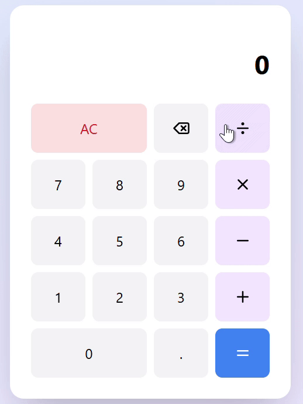

# React Calculator 🔢

Sebuah aplikasi kalkulator sederhana berbasis React, dibuat menggunakan Vite dan JavaScript + SWC untuk performa optimal.

## 🚀 Fitur

- Penjumlahan, pengurangan, perkalian, pembagian
- Desain minimalis dan responsif
- Dibuat dengan React + Vite




## 🛠️ Cara Menjalankan di Lokal

1. **Clone repository:**

```bash
git clone https://github.com/danielaugust67/Simple-Calculator-React.git
```
2. **Install Depedenciy**

```bash
npm install
```
```bash
npm run dev
```

